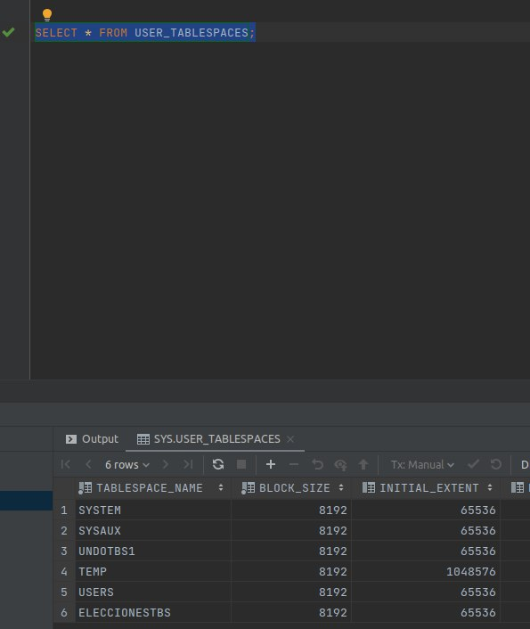

# PY1_Bases2

## Instalación Oracle en Instancia GCP con Centos 7 y conexión a SQL Developer

Para el desarrollo de este proyecto, se necesita una base de datos Oracle. La version de dicha base de datos será la 21c y estará en una instancia en la nube de Google (Google Cloud Computing [GCP])-

Para realizar la instalación se requiere crear una máquina virtual como la siguiente: 

Estas instancias poseen diferentes maneras de conexión, entre ellas la conexión SSH el cual está integrado con el servicio, si se desea conectar con otro tipo de software, por ejemplo Termius; se debe generar una llave por medio de keygen. En linux se usa el siguiente comando : 
<code>ssh-keygen -t rsa -f ~/.ssh/NOMBRELLAVE -C usuaio -b 2048
</code>

Lo cual crea 2 archivos, uno de los cuales es .pub y bajo la pestaña de edición de la máquina virtual se agrega en :

Para la conexión y acceso a la instancia se necesitan 2 configuraciones, la primera es una regla de firewall donde permite la entrada y salida de trafico desde cualquier IP hacia cualquier puerto: 

Y la segunda (opcional) es configurar una IP estática si no se desea configurar multiples veces la IP de conexión en las demás herramientas:

Al hacer click en Crear Dirección IP, la IP actual de la máquina será reservada y asignada a la instancia como dirección IP estática. 

 
Una vez todo esto ha sido configurado se puede proceder a la instalación de Oracle:

1.- Instalar los siguientes paquetes: 
<code>sudo yum install unzip libaio bc flex wget</code>

2.- Crear archivo Swap de 2GB:
<code>sudo dd if=/dev/zero of=/mnt/swapfile bs=1024 count=2097152 </code>

3.- Dar permisos al archivo de swap uusando el comando sudo:
<code> sudo chmod 600 /mnt/swapfile</code>

4.- Setear el archivo para swap usando el comando mkswap:
<code>sudo mkswap /mnt/swapfile </code>
 

5.- Habilitar el archivo de swap para ser reconocido como la swap del sistema:
<code> swapon /mnt/swapfile</code>

6.- Habilitar el archivo swap para que este inicie en a la hora de encender la instancia, para esto se hace uso de nano y se agrega la siguiente linea a /etc/fstab:
<code> /mnt/swapfile swap swap defaults 0 0</code>

7.- Descargar el archivo de pre instalación de oracle haciendo uso de los siguientes comandos: 
<code>   curl -o oracle-database-preinstall-21c-1.0-1.el7.x86_64.rpm https://yum.oracle.com/repo/OracleLinux/OL7/latest/x86_64/getPackage/oracle-database-preinstall-21c-1.0-1.el7.x86_64.rpm  
 yum -y localinstall oracle-database-preinstall-21c-1.0-1.el7.x86_64.rpm</code>

 
8.- Descargar el archivo correspondiente de Oracle 21c XE:
<code>wget https://download.oracle.com/otn-pub/otn_software/db-express/oracle-database-xe-21c-1.0-1.ol7.x86_64.rpm </code>

 
9.- Realizar la instalación:
<code>  yum -y localinstall oracle-database-xe-21c-1.0-1.ol7.x86_64.rpm</code>

 
10.- configurar Oracle, este password es el usado en las diferentes seciones marcadas :
<code> /etc/init.d/oracle-xe-21c configure</code>

11.- Si se requiere iniciar la instancia nuevamente :
<code> sudo /etc/init.d/oracle-xe-21c start</code>

## Conexión a Oracle 21c usando SQL Developer o DataGrid
una vez levantada la base de datos solo será necesaria la informacion de IP, puerto y tipo

-----

## Parte 1

En la siguiente sección se basa en la creación de usuarios (los cuales en ORACLE pueden verse como esquemas) y sus privilegios.

El siguiente modelo será usado para este ejercicio: 

Primero, es necesario crear un TableSpace, el cual es el encargado de almacenar tablas, indices, objetos y datos. Organiza la información en grupos de almacenamiento lógicos que se relaciona a la informacion almacenada en un sistema. 

Y esto se logra con el siguiente comando:
<code>CREATE TABLESPACE [Nombre] DATAFILE "[nombre_datafile].tbs" SIZE [tamaño_inicio] AUTOEXTEND ON MAXSIZE [max_size]</code>

Donde la propiedad de Autoextend permite que el tamaño inicial del archivo se entienda a su máximo una sola vez.

<em> <code>CREATE TABLESPACE ELECCIONESTBS DATAFILE "ELECCIONESDTF.tbs" SIZE 200M AUTOEXTEND ON MAXSIZE 500M </code></em>

Ahora se necesita un usuario para almacenar la base de datos, haciendo uso del siguiente comando

<code>CREATE USER [ususario] IDENTIFIED BY [password] DEFAULT TABLESPACE [tablespace] TEMPORARY TABLESPACE Temp ACCOUNT UNLOCK </code>

+ Nota: Si no se especifica el parámetro <code>PROFILE</code> , este será <code>DEFAULT </code> por defecto.
+ Unlock sirve para que el ususario pueda cambiar su contraseña a la hora de volver a loguearse

Ahora se procede a otorgarle permisos de DBA al usuario creado anteriormente:  
<code>GRANT "DBA" TO [usuario] WITH ADMIN OPTION </code>

Finalmente se le conceden permisos para poder crear una sesión al usuario:  
<code>GRANT ALTER SESSION TO [usuario] WITH ADMIN OPTION</code>

El resultado final sería el siguiente: 

<code>CREATE USER ELECCIONES IDENTIFIED BY [password] DEFAULT TABLESPACE ELECCIONESTBS TEMPORARY TABLESPACE Temp ACCOUNT UNLOCK    GRANT "DBA" TO ELECCIONES WITH ADMIN OPTION  GRANT ALTER SESSION TO ELECCIONES WITH ADMIN OPTION</code>
 
 

  
   
  <em>Al hacer SELECT sobre la tabla que que contiene las tablespaces, podemos ver la información de la que acabamos de crear (6)</em>
 
 
Finalmente se procede a crear la conección con el usuario creado.

### Creación de Datos

Dada la [configuración](Carga/Corregido.sql)  se procede a ser ejecutada en "ELECCIONES" para así poder proseguir con la creación de usuarios y sus privilegios siguiendo lo siguiente:

+ Creación de Usuarios
  Se requieren los siguientes usuarios: 
  

| Usuario | Contraseña |
|---------|-------------|
| guest1  | guest1      |
| guest2  | guest2      |
| guest3  | guest3      |
| mesa1   | mesa1       |
| mesa2   | mesa2       |
| mesa3   | mesa3       |
| mesa4   | mesa4       |
| it1     | it1         |
| it2     | it2         |
| admin1  | admin1      |
| admin2  | admin2      |
  
La manera de crear nuevos usuarios para la tablespace es la siguiente:
 
 
<code>CREATE USER [usuario] IDENTIFIED BY [password] DEFAULT TABLESPACE
    ELECCIONESTBS TEMPORARY TABLESPACE  TEMP ACCOUNT UNLOCK ;
 </code>

   
    
   

+ Privilegios de cada Usuario
  
  Se requieren permisos específicos para cada usuario, por lo tanto:

  

  + UPDATE: <code>GRANT UPDATE ANY TABLE TO [usuario]; </code>
   

  + INSERT: <code> GRANT INSERT ANY TABLE TO [usuario];</code>
  + SELECT: <code> GRANT SELECT ANY TABLE TO [usauario] </code>
  + DELETE: <code> GRANT DELETE ANY TABLE TO [usuario]; </code>
  + CREAR TABLAS: <code> GRANT CREATE USER TO [usuario];</code>

Además que a todos los usuarios se les proporciona el privilegio para crear y loggearse a su propia seción

<code> </code>

Seguir el [siguiente link](Carga/users_permitions.sql) para una versión más completa de todos los comandos usados

### Creación de Vista y Otorgación a usuario "GUEST1"